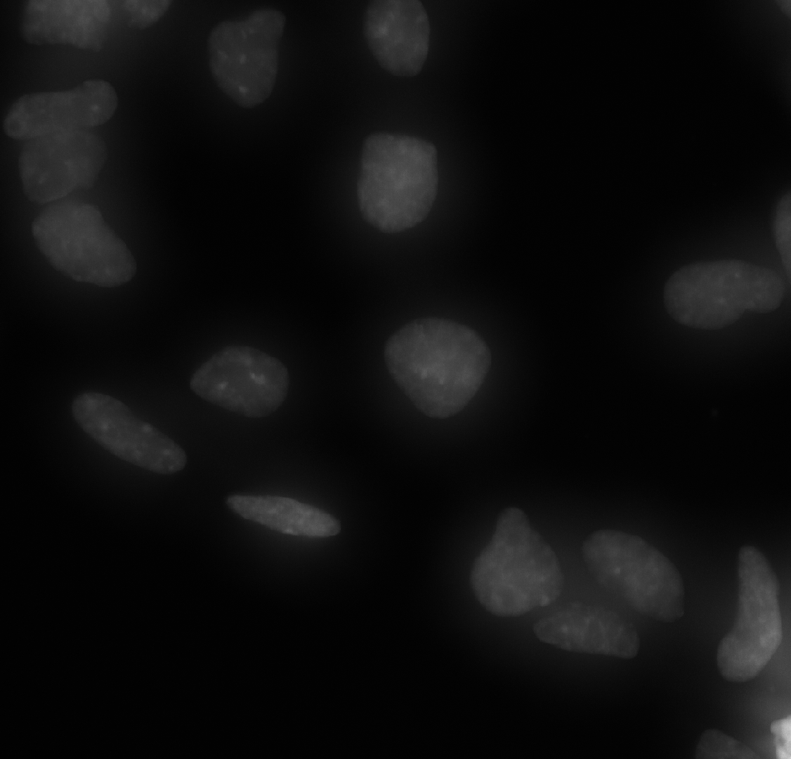
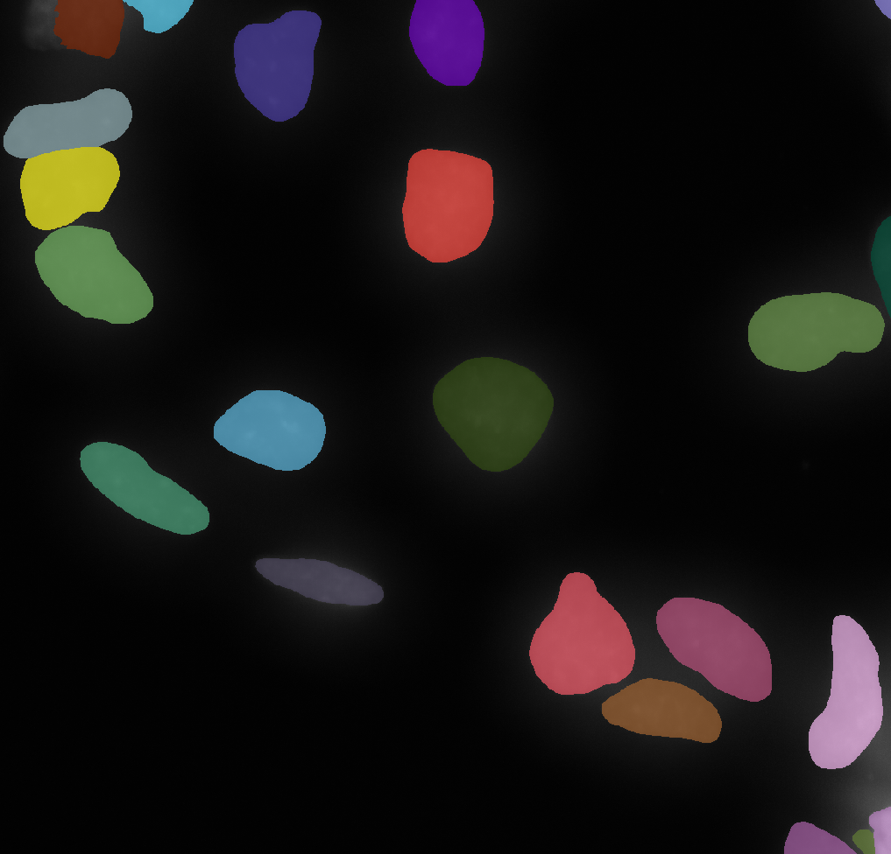
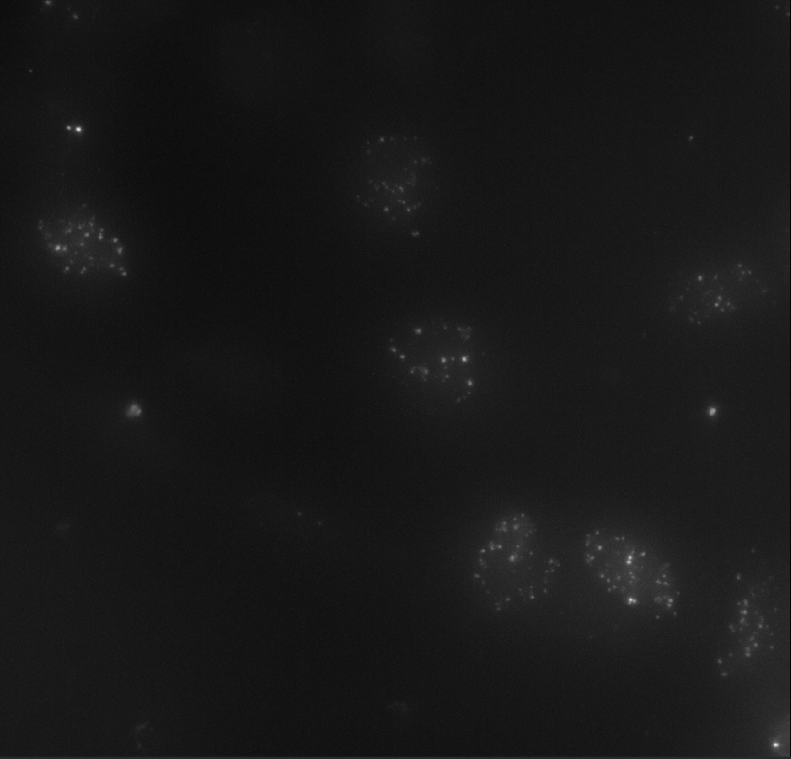
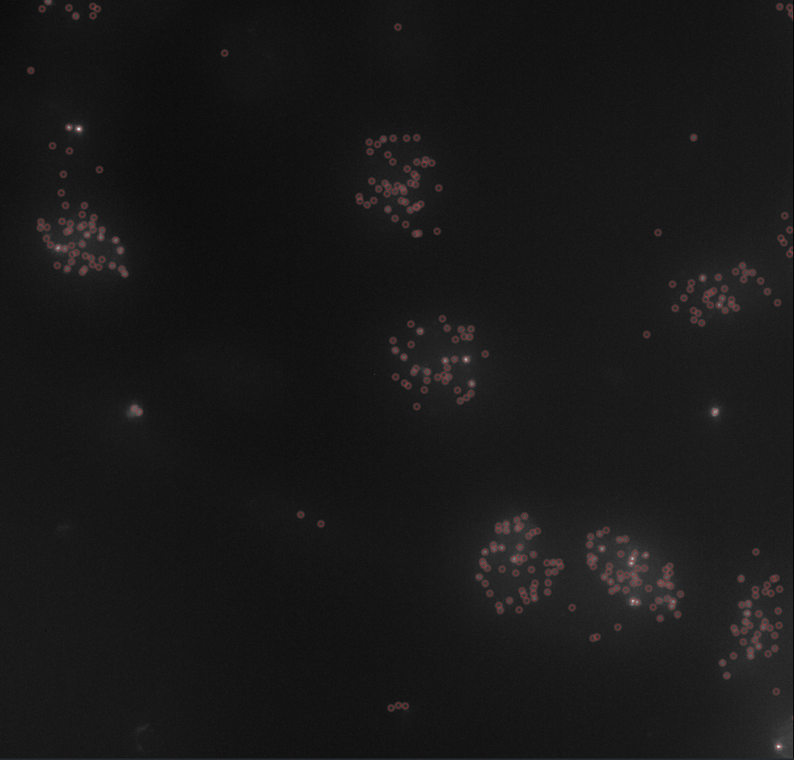

### Segmentation
Segmentation is performed using either [CellPose](https://www.nature.com/articles/s41592-020-01018-x) or [StarDist](https://arxiv.org/abs/1806.03535). For CellPose, the Cyto3 model is used.

  
  

### Spot Detection
Spot detection is performed using [Spotiflow](https://www.nature.com/articles/s41592-025-02662-x). As an extra validation step, spots detected outside of segmented nuclei will be removed before calculating output features.

  
  

